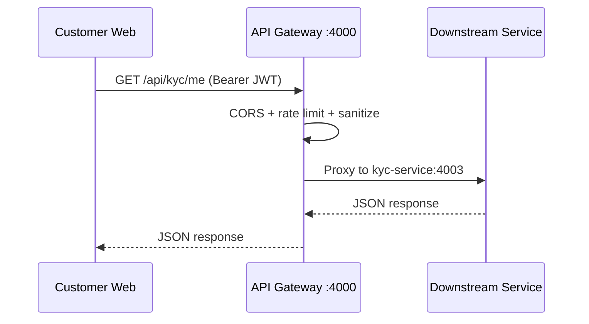

# API Gateway

**Package:** `@finboard/api-gateway`  
**Port:** `4000`  
**Location:** `services/api-gateway/`

## Overview

The API Gateway is the single HTTP entry point for all Finboard client applications (customer web, admin tools). It reverse-proxies requests to the correct downstream microservice, applies gateway-level security, rate limiting, and serves interactive API documentation.

The gateway is **stateless** — it does not own business data or connect to a database.

## Responsibilities

- Route incoming HTTP requests to the correct backend service by URL prefix
- Enforce CORS for allowed client origins
- Apply Helmet security headers and CSP for the Scalar docs UI
- Rate-limit requests (100/min production, 1000/min development)
- Expose `/health` for uptime checks
- Serve OpenAPI spec and Scalar API reference at `/docs`

## Route table

| Prefix | Target service | Port |
|--------|----------------|------|
| `/api/auth/*` | auth-service | 4001 |
| `/api/profile/*` | profile-service | 4002 |
| `/api/kyc/*` | kyc-service | 4003 |
| `/api/documents/*` | ocr-service | 4004 |
| `/api/ocr/*` | ocr-service | 4004 |
| `/api/banking/*` | banking-service | 4005 |
| `/api/investments/*` | investment-service | 4006 |
| `/api/notifications/*` | notification-service | 4007 |
| `/api/audit/*` | audit-service | 4008 |
| `/uploads/*` | kyc-service | 4003 |

## Endpoints (gateway-owned)

| Method | Path | Description |
|--------|------|-------------|
| GET | `/health` | Gateway health + full route table |
| GET | `/openapi.json` | OpenAPI specification |
| GET | `/docs` | Scalar interactive API reference |
| GET | `/docs/scalar.js` | Scalar bundle script |

All other paths matching the route table are proxied transparently to the target service.

## Request flow



### Step-by-step

1. Client sends request to `http://localhost:4000/api/{domain}/...`
2. Gateway matches the longest prefix in the route table
3. `http-proxy-middleware` forwards the request to the target service URL (from `getServiceUrls()` in `@finboard/contracts`)
4. Response is streamed back to the client unchanged
5. JWT validation and business logic happen in the downstream service, not the gateway

## Directory structure

```
services/api-gateway/
├── src/
│   ├── server.js          # Bootstrap, listen on PORT
│   ├── app.js             # Proxy table, middleware, docs
│   └── openapi/
│       ├── load-spec.js   # Load docs/openapi.yaml
│       └── scalar.js      # Scalar UI configuration
├── Dockerfile
├── jest.config.js
└── package.json
```

## Dependencies

| Dependency | Purpose |
|------------|---------|
| `http-proxy-middleware` | Reverse proxy to microservices |
| `helmet` | Security headers |
| `cors` | Cross-origin access control |
| `express-rate-limit` | Request throttling |
| `@scalar/express-api-reference` | API docs UI |
| `@finboard/contracts` | Service URL resolution |
| `@finboard/shared` | Error handling, env helpers |

## Events

None. The gateway does not publish or consume Kafka events.

## Environment variables

| Variable | Description |
|----------|-------------|
| `PORT` | Listen port (default `4000`) |
| `CLIENT_ORIGIN` | Comma-separated allowed CORS origins |
| `AUTH_SERVICE_URL`, `PROFILE_SERVICE_URL`, etc. | Downstream service base URLs |

## Run locally

```bash
pnpm --filter @finboard/api-gateway dev
```

API docs: http://localhost:4000/docs
