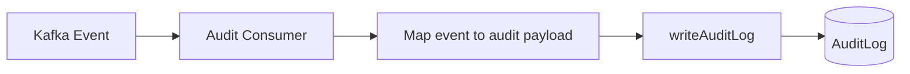

# Audit Service

**Package:** `@finboard/audit-service`  
**Port:** `4008`  
**Location:** `services/audit-service/`

## Overview

The Audit Service maintains an **immutable audit trail** for compliance simulation and admin investigation. It ingests all domain events from Kafka and also accepts direct HTTP audit writes from other services when Kafka is disabled.

Every significant platform action — KYC lifecycle, bank verification, investment orders — is recorded with actor, action, resource, and contextual details.

## Responsibilities

- Consume all Kafka domain events and persist audit entries
- Accept direct audit writes via internal HTTP API
- Expose read API for admins to query audit logs by resource
- Capture request context (IP, user agent) on direct writes

## Database

**MongoDB** (`MONGODB_URI`) — collection: `auditlogs`

Indexed on `(resourceType, resourceId, createdAt)` for efficient lookups.

## API endpoints

### Public — `/api/audit` (requires JWT + admin role)

| Method | Path | Role | Description |
|--------|------|------|-------------|
| GET | `/:resourceType/:resourceId` | admin, rta_admin | Audit entries for a resource (last 100) |

### Internal — `/internal/audit`

| Method | Path | Description |
|--------|------|-------------|
| POST | `/` | Write audit log entry |

Internal routes require `x-service-key` header.

### Health

| Method | Path | Description |
|--------|------|-------------|
| GET | `/health` | Service health check |

## Data model

### AuditLog

| Field | Type | Description |
|-------|------|-------------|
| `actorId` | String | User ID who performed the action |
| `actorRole` | Enum | `user` \| `admin` \| `rta_admin` \| `amc_admin` \| `system` |
| `action` | String | Action identifier (e.g. `KYC_SUBMITTED`) |
| `resourceType` | String | Resource category (e.g. `kyc_application`) |
| `resourceId` | String | Resource identifier |
| `details` | Mixed | Event payload and metadata |
| `ipAddress` | String | Client IP (or `kafka` for event-driven) |
| `userAgent` | String | Client user agent |
| `createdAt` | Date | Timestamp (immutable) |

## Business flows

### Kafka audit ingestion



1. Audit consumer subscribes to **all** defined Kafka topics
2. On each message, maps event to audit payload:
   - `actorId` = `event.userId`
   - `actorRole` = `system`
   - `action` = derived from event action or topic name
   - `resourceType` / `resourceId` from event
   - `details` = full event payload
3. Persist `AuditLog` (append-only, never updated)

### Direct audit write (Kafka off)

When Kafka is disabled, services call `audit()` helper from `@finboard/contracts`:

1. Service completes action (e.g. KYC submit in kyc-service)
2. Calls `audit(req, action, resourceType, resourceId, details)`
3. POST to `/internal/audit` with request context (IP, user agent, actor from JWT)
4. Audit entry persisted with actual user as actor

### Admin audit query

1. Admin navigates to a KYC application or user record
2. Frontend calls `GET /api/audit/kyc_application/{id}`
3. Service returns last 100 entries sorted by `createdAt` descending

## Events consumed

All Kafka domain topics:

| Topic | Audit action |
|-------|-------------|
| `kyc.submitted` | KYC submission |
| `kyc.approved` | KYC approval |
| `kyc.rejected` | KYC rejection |
| `bank.verified` | Bank verification |
| `bank.transfer.completed` | Transfer completed |
| `order.placed` | Order placed |
| `order.approved` | Order approved |
| `order.rejected` | Order rejected |
| `sip.created` | SIP created |

## Events published

None.

## Service dependencies

| Service | Direction | Purpose |
|---------|-----------|---------|
| Kafka | Inbound | All domain event consumption |
| kyc-service, banking-service, investment-service | Inbound | Direct audit HTTP calls |

## Directory structure

```
services/audit-service/
├── src/
│   ├── server.js
│   ├── app.js
│   ├── bootstrap/register-handlers.js
│   ├── kafka/audit-consumer.js
│   └── modules/audit/
│       ├── routes/audit.routes.js
│       ├── models/audit-log.model.js
│       └── services/audit.service.js
├── Dockerfile
└── package.json
```

## Environment variables

| Variable | Description |
|----------|-------------|
| `MONGODB_URI` | MongoDB connection string |
| `KAFKA_BROKERS` | Kafka connection |
| `INTERNAL_SERVICE_KEY` | Internal route authentication |

## Run locally

```bash
pnpm --filter @finboard/audit-service dev
```

## Design notes

- Audit logs are **append-only** — no update or delete APIs
- Kafka-driven entries use `actorRole: system` since the event carries the user ID but not the HTTP request context
- Direct writes preserve full request context (IP, user agent, JWT actor) for admin actions
