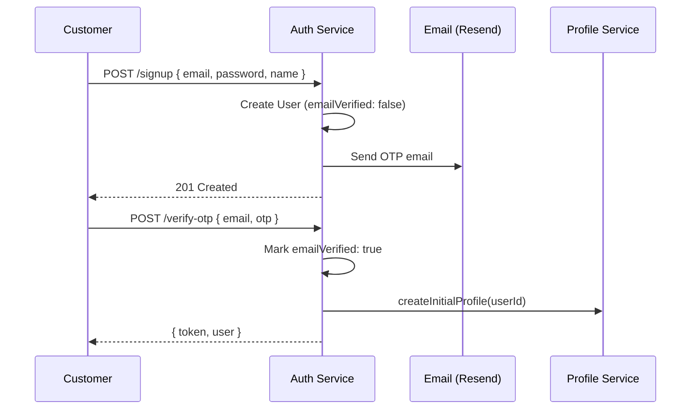

# Auth Service

**Package:** `@finboard/auth-service`  
**Port:** `4001`  
**Location:** `services/auth-service/`

## Overview

The Auth Service owns user identity, authentication, and authorization for the Finboard platform. It handles customer and admin sign-up, email OTP verification, password management, JWT issuance, and internal user lookups for other microservices.

## Responsibilities

- Register new users (email + password)
- Send and verify email OTP codes
- Issue JWT access tokens on successful authentication
- Support customer sign-in, admin sign-in, and OTP-based email login
- Password change, forgot-password, and reset-password flows
- Expose internal APIs for other services to fetch user records

## Database

**MongoDB** (`MONGODB_URI`) — collection: `users`

## API endpoints

### Public — `/api/auth`

| Method | Path | Auth | Description |
|--------|------|------|-------------|
| POST | `/signup` | — | Register; sends email OTP |
| POST | `/signin` | — | Email/password login (customers) |
| POST | `/admin/signin` | — | Admin portal login |
| POST | `/send-otp` | — | Send email OTP |
| POST | `/verify-otp` | — | Verify OTP; completes registration |
| POST | `/email-login` | — | OTP-based login |
| GET | `/me` | JWT | Current authenticated user |
| PATCH | `/change-password` | JWT | Change password |
| POST | `/forgot-password` | — | Send password reset OTP |
| POST | `/reset-password` | — | Reset password with OTP |

### Internal — `/internal`

| Method | Path | Description |
|--------|------|-------------|
| GET | `/users/:id` | Get user by ID |
| POST | `/users/batch` | Batch fetch users by IDs |
| GET | `/users?role=` | List users (optional role filter) |

Internal routes require header `x-service-key: {INTERNAL_SERVICE_KEY}`.

### Health

| Method | Path | Description |
|--------|------|-------------|
| GET | `/health` | Service health check |

## Data model

### User

| Field | Type | Description |
|-------|------|-------------|
| `name` | String | Display name |
| `email` | String | Unique email address |
| `phone` | String | Phone number |
| `passwordHash` | String | bcrypt hashed password |
| `role` | Enum | `user`, `admin`, `rta_admin`, `amc_admin` |
| `phoneVerified` | Boolean | Phone verification flag |
| `emailVerified` | Boolean | Email verification flag |
| `lastLoginAt` | Date | Last successful login |

Methods: `setPassword()`, `comparePassword()`, `toSafeJSON()` (strips sensitive fields).

## Business flows

### Customer sign-up



1. User submits name, email, and password
2. Service creates a `User` with `emailVerified: false`
3. OTP is generated and emailed via Resend (`@finboard/email`)
4. User submits OTP via `/verify-otp`
5. Email is marked verified; JWT is issued
6. Profile Service is called to create an initial user profile

### Customer sign-in

1. User submits email and password via `POST /signin`
2. Service validates credentials and `emailVerified === true`
3. Admin roles are rejected (must use `/admin/signin`)
4. JWT issued; `lastLoginAt` updated

### Password reset

1. `POST /forgot-password` — send reset OTP to email
2. `POST /reset-password` — verify OTP, update `passwordHash`

### Admin sign-in

1. `POST /admin/signin` with admin credentials
2. Only `admin`, `rta_admin`, or `amc_admin` roles allowed
3. JWT issued with role claim for downstream `requireRole` checks

## Service dependencies

| Service / Package | Direction | Purpose |
|-------------------|-----------|---------|
| profile-service | Outbound | Create initial profile on OTP verification |
| `@finboard/email` (Resend) | Outbound | OTP and password reset emails |
| jsonwebtoken | — | JWT signing |
| bcryptjs | — | Password hashing |

## Events

None. Auth does not publish or consume Kafka events.

## Directory structure

```
services/auth-service/
├── src/
│   ├── server.js
│   ├── app.js
│   ├── bootstrap/register-handlers.js
│   ├── common/helpers/jwt.helper.js
│   ├── infrastructure/database/mongo.js
│   └── modules/auth/
│       ├── controllers/auth.controller.js
│       ├── models/user.model.js
│       ├── routes/auth.routes.js
│       ├── routes/auth.internal.routes.js
│       ├── services/otp.service.js
│       ├── services/email.service.js
│       ├── validators/auth.schema.js
│       └── jobs/auth.seed.js
├── Dockerfile
└── package.json
```

## Environment variables

| Variable | Description |
|----------|-------------|
| `MONGODB_URI` | MongoDB connection string |
| `JWT_SECRET` | JWT signing secret |
| `JWT_EXPIRES_IN` | Token expiry (e.g. `7d`) |
| `BCRYPT_SALT_ROUNDS` | Password hash rounds |
| `RESEND_API_KEY` | Email delivery API key |
| `INTERNAL_SERVICE_KEY` | Internal route authentication |
| `PROFILE_SERVICE_URL` | Profile service base URL |

## Run locally

```bash
pnpm --filter @finboard/auth-service dev
pnpm seed:admin   # Seed admin users
```
