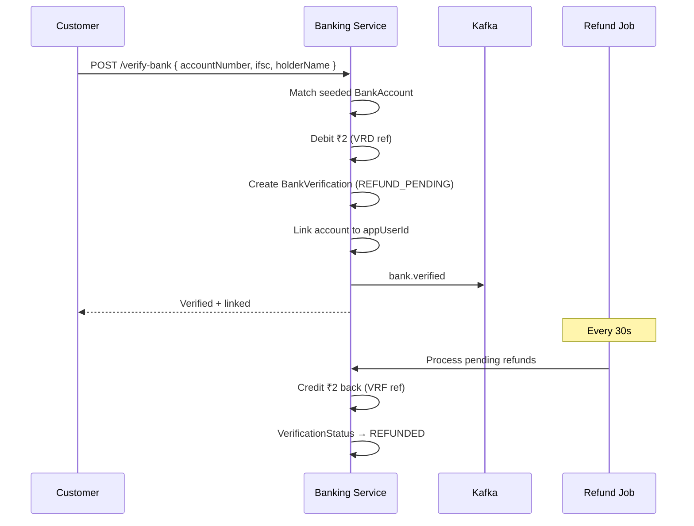
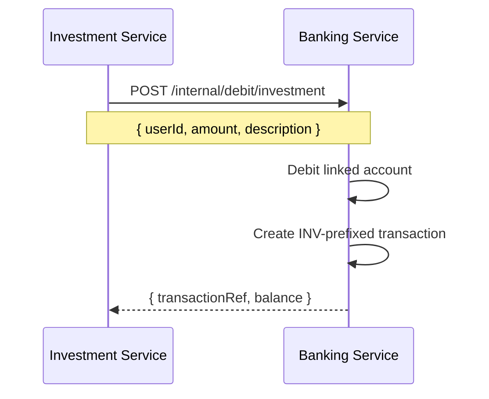

# Banking Service

**Package:** `@finboard/banking-service`  
**Port:** `4005`  
**Location:** `services/banking-service/`

## Overview

The Banking Service provides a **simulated demo core banking** layer for Finboard. It supports account linking, ₹2 verification debit with automatic refund, peer transfers, beneficiaries, transaction history, and admin account management. It also debits user accounts when Investment Service places orders.

> This is a demo/simulation — it does not connect to real banks, UPI, or payment gateways.

## Responsibilities

- List seeded demo bank accounts for new users
- Verify and link a bank account (₹2 test debit, auto-refunded)
- Transfer money between demo accounts
- Manage beneficiaries and transaction history
- Provide in-banking notifications (separate from app notifications)
- Admin: view all accounts, freeze/unfreeze, reset balances
- Internal debit API for investment purchases

## Database

**PostgreSQL** via **Prisma** (`BANK_DATABASE_URL`)

| Model | Purpose |
|-------|---------|
| **BankAccount** | Demo bank accounts; linked to app user via `appUserId` |
| **Beneficiary** | Saved transfer recipients |
| **BankTransaction** | Debits/credits with reference codes |
| **LedgerEntry** | Double-entry ledger per account |
| **BankNotification** | In-banking notification inbox |
| **BankVerification** | Verification attempts + refund tracking |

**Enums:** `BankRole`, `AccountStatus`, `TransactionStatus`, `TransactionType`, `VerificationStatus`

## API endpoints

### Public — `/api/banking` (requires JWT + banking DB configured)

| Method | Path | Role | Description |
|--------|------|------|-------------|
| GET | `/demo-accounts` | user | List seeded demo accounts |
| GET | `/account` | user | Linked account + recent transactions |
| GET | `/accounts` | user | All linked accounts |
| GET | `/balance` | user | Alias for `/account` |
| GET | `/lookup/:accountNumber` | user | Lookup account by number |
| DELETE | `/accounts/:id` | user | Unlink account |
| POST | `/verify-bank` | user | Verify and link bank (₹2 debit) |
| POST | `/beneficiary` | user | Add beneficiary |
| POST | `/transfer` | user | Transfer money |
| GET | `/transactions` | user | Transaction history |
| GET | `/notifications` | user | Banking notifications |
| DELETE | `/notifications/:id` | user | Delete notification |
| GET | `/admin/users` | admin | All bank accounts |
| GET | `/admin/transactions` | admin | All transactions |
| PATCH | `/admin/users/:id/freeze` | admin | Freeze/unfreeze account |
| PATCH | `/admin/users/:id/reset-balance` | admin | Reset account balance |

### Internal — `/internal`

| Method | Path | Description |
|--------|------|-------------|
| GET | `/accounts/linked/:userId` | Get linked account for user |
| POST | `/debit/investment` | Debit account for investment order |

## Business flows

### Bank verification (₹2 test)



1. User submits account number, IFSC, and holder name
2. Service matches against seeded `BankAccount` records
3. Debits ₹2 (`VERIFICATION_AMOUNT`) from the demo account
4. Creates `BankVerification` with status `REFUND_PENDING`
5. Links account to user's `appUserId`
6. Publishes `bank.verified` Kafka event
7. Background refund job (every 30s) credits ₹2 back after ~45 seconds

### Transfer

1. Validate sender has a linked account and sufficient balance
2. Validate receiver account exists
3. Atomic debit from sender, credit to receiver
4. Create ledger entries for both accounts
5. Create in-banking notifications for sender and receiver

### Investment debit (internal)



Called by Investment Service before creating a portfolio holding.

## Service dependencies

| Service | Direction | Purpose |
|---------|-----------|---------|
| investment-service | Inbound | Investment debit calls |
| Kafka | Outbound | Publish `bank.verified` |

## Events published

| Topic | When |
|-------|------|
| `bank.verified` | Successful bank verification |

> `bank.transfer.completed` is defined in contracts but not yet published by this service.

## Events consumed

None.

## Directory structure

```
services/banking-service/
├── prisma/
│   ├── schema.prisma
│   ├── seed.js
│   └── migrations/
├── src/
│   ├── server.js
│   ├── app.js
│   ├── bootstrap/register-handlers.js
│   ├── infrastructure/database/prisma.js
│   └── modules/banking/
│       ├── controllers/banking.controller.js
│       ├── routes/banking.routes.js
│       ├── routes/banking.internal.routes.js
│       ├── services/banking.service.js
│       ├── services/banking-events.service.js
│       ├── services/banking-notification.service.js
│       ├── jobs/refund.job.js
│       ├── middleware/require-banking-configured.middleware.js
│       └── validators/banking.schema.js
├── Dockerfile
└── package.json
```

## Environment variables

| Variable | Description |
|----------|-------------|
| `BANK_DATABASE_URL` | PostgreSQL connection string |
| `KAFKA_BROKERS` | Kafka connection (optional) |
| `INTERNAL_SERVICE_KEY` | Internal route authentication |

## Run locally

```bash
pnpm --filter @finboard/banking-service dev
pnpm seed:banking          # Seed demo accounts
pnpm prisma:migrate:dev     # Run migrations
```

## Transaction reference codes

| Prefix | Meaning |
|--------|---------|
| `VRD` | Verification debit |
| `VRF` | Verification refund |
| `DBT` | Debit transfer |
| `CDT` | Credit transfer |
| `INV` | Investment debit |
