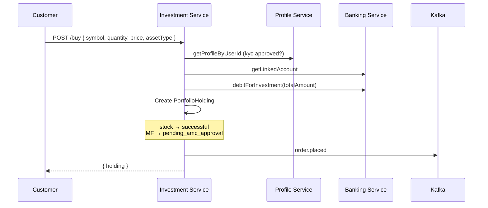

# Investment Service

**Package:** `@finboard/investment-service`  
**Port:** `4006`  
**Location:** `services/investment-service/`

## Overview

The Investment Service manages portfolio holdings and investment orders — stock purchases, mutual fund orders, SIP setup, and admin AUM overview. It enforces that users have **approved KYC** and a **linked bank account** before allowing any investment.

## Responsibilities

- List user portfolio holdings
- Execute buy orders for stocks and mutual funds
- Create SIP (Systematic Investment Plan) mandates
- Debit linked bank account via Banking Service
- Admin overview of AUM, SIP book, and pending orders
- Admin order status management (approve/reject MF orders)
- Publish investment domain events

## Database

**MongoDB** (`MONGODB_URI`) — collection: `portfolioholdings`

## API endpoints

### Public — `/api/investments` (requires JWT)

| Method | Path | Role | Description |
|--------|------|------|-------------|
| GET | `/portfolio` | user | User holdings |
| POST | `/buy` | user | Buy stock or mutual fund |
| POST | `/sip` | user | Create SIP |
| GET | `/admin/overview` | admin, rta_admin, amc_admin | AUM summary + all holdings |
| PATCH | `/admin/orders/:id/status` | admin, amc_admin | Update order status |

### Internal — `/internal/portfolio`

| Method | Path | Description |
|--------|------|-------------|
| GET | `/` | List all holdings |
| GET | `/users/:userId` | User holdings |
| POST | `/` | Create holding |
| PATCH | `/:id` | Update holding |

## Data model

### PortfolioHolding

| Field | Type | Description |
|-------|------|-------------|
| `userId` | ObjectId | Investor user ID |
| `assetType` | Enum | `stock` \| `mutual_fund` \| `sip` |
| `symbol` | String | Ticker / fund symbol |
| `name` | String | Display name |
| `quantity` | Number | Units held |
| `purchasePrice` | Number | Price at purchase |
| `currentPrice` | Number | Current NAV/price |
| `totalAmount` | Number | Total invested amount |
| `orderStatus` | Enum | See below |
| `folioNumber` | String | MF/SIP folio number |
| `sipDate` | Number | SIP debit day of month |
| `sipAmount` | Number | Monthly SIP amount |
| `nextDebitDate` | Date | Next SIP debit date |
| `amcAccount` | Object | AMC collection account details |
| `metadata` | Object | Additional metadata |

**Order status values:** `pending_amc_approval` | `successful` | `rejected` | `sip_active` | `sip_paused` | `sip_stopped`

## Business flows

### Investment eligibility check

Before any buy or SIP:

1. Fetch profile from Profile Service — `kycStatus` must be `approved`
2. Fetch linked account from Banking Service — must exist
3. If either check fails, return 403/400

### Buy stock or mutual fund



1. Validate KYC approved + bank linked
2. Calculate `totalAmount = price × quantity`
3. Call Banking Service `debitForInvestment()`
4. Create `PortfolioHolding`:
   - Stocks → `orderStatus: successful`
   - Mutual funds → `orderStatus: pending_amc_approval`
5. Publish `order.placed` event

### Create SIP

1. Eligibility check (KYC + bank)
2. Debit first installment via Banking Service
3. Calculate units from `monthlyAmount / nav`
4. Create holding with `assetType: sip`, `orderStatus: sip_active`
5. Compute `nextDebitDate` from SIP day of month
6. Publish `sip.created` event

### Admin order status update

1. Admin calls `PATCH /admin/orders/:id/status`
2. Allowed statuses: `successful`, `rejected`, `pending_amc_approval`, `sip_active`, `sip_paused`, `sip_stopped`
3. If status → `successful`, publish `order.approved`
4. If status → `rejected`, publish `order.rejected`

## Service dependencies

| Service | Direction | Purpose |
|---------|-----------|---------|
| banking-service | Outbound | `debitForInvestment()`, `getLinkedAccount()` |
| profile-service | Outbound | KYC eligibility check |
| auth-service | Outbound | `listUsersByRole()` for admin overview |
| notification-service | Outbound | Direct notify when Kafka off |
| Kafka | Outbound | Order/SIP events |

## Events published

| Topic | When |
|-------|------|
| `order.placed` | Stock or MF buy order created |
| `sip.created` | SIP mandate created |
| `order.approved` | Admin sets status to `successful` |
| `order.rejected` | Admin sets status to `rejected` |

## Events consumed

None.

## Directory structure

```
services/investment-service/
├── src/
│   ├── server.js
│   ├── app.js
│   ├── bootstrap/register-handlers.js
│   └── modules/investment/
│       ├── routes/investment.routes.js
│       ├── routes/portfolio.internal.routes.js
│       ├── models/portfolio-holding.model.js
│       ├── services/investment-events.service.js
│       └── validators/investment.schema.js
├── Dockerfile
└── package.json
```

## Environment variables

| Variable | Description |
|----------|-------------|
| `MONGODB_URI` | MongoDB connection string |
| `KAFKA_BROKERS` | Kafka connection (optional) |
| `BANKING_SERVICE_URL` | Banking service base URL |
| `PROFILE_SERVICE_URL` | Profile service base URL |

## Run locally

```bash
pnpm --filter @finboard/investment-service dev
```
