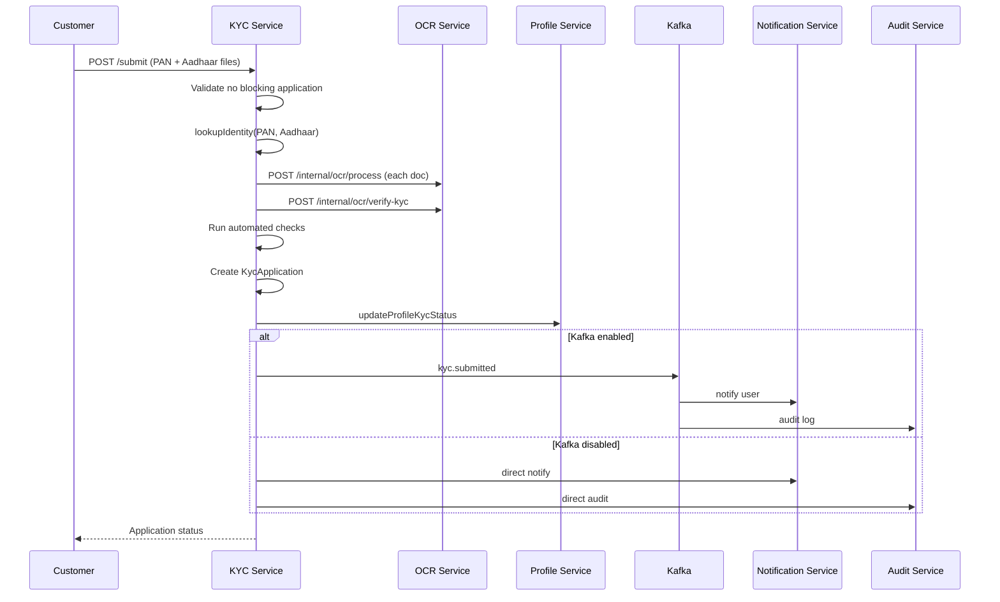

# KYC Service

**Package:** `@finboard/kyc-service`  
**Port:** `4003`  
**Location:** `services/kyc-service/`

## Overview

The KYC Service manages the full Know Your Customer lifecycle: document upload, automated OCR and AI verification, identity matching against a seeded reference database, admin review queue, and approval/rejection workflows.

## Responsibilities

- Accept PAN and Aadhaar document uploads from investors
- Orchestrate OCR extraction and AI verification via OCR Service
- Match submitted identity against seeded `DummyIdentity` records
- Queue applications for admin/RTA review
- Update profile KYC status on state changes
- Publish domain events for notifications and audit
- Serve uploaded document files (local disk or S3)

## Database

**MongoDB** (`MONGODB_URI`)

| Collection | Purpose |
|------------|---------|
| `kycapplications` | KYC application records |
| `dummyidentities` | Seeded government-style identity reference data |

**File storage:** Local `uploads/kyc/` or S3-compatible storage (`S3_*` env vars via `@finboard/storage`)

## API endpoints

### Public — `/api/kyc` (all routes require JWT)

| Method | Path | Role | Description |
|--------|------|------|-------------|
| GET | `/me` | user | Latest KYC application + resubmit eligibility |
| POST | `/submit` | user | Submit PAN + Aadhaar (multipart upload) |
| GET | `/admin/applications` | admin, rta_admin | Paginated application list |
| GET | `/admin/applications/:id` | admin, rta_admin | Application detail + review bundle |
| POST | `/admin/applications/:id/approve` | admin, rta_admin | Approve KYC |
| POST | `/admin/applications/:id/reject` | admin, rta_admin | Reject KYC |

### Internal — `/internal/identity`

| Method | Path | Description |
|--------|------|-------------|
| POST | `/lookup` | Lookup seeded identity by PAN + Aadhaar |

### Static files

| Path | Description |
|------|-------------|
| `/uploads/*` | KYC document files (proxied via gateway) |

## Data models

### KycApplication

| Field | Description |
|-------|-------------|
| `userId` | Investor user ID |
| `name`, `panNumber`, `aadhaarNumber` | Submitted identity |
| `dummyIdentityId` | Matched reference identity |
| `status` | `draft` \| `failed` \| `pending_admin_review` \| `approved` \| `rejected` \| `reupload_requested` |
| `checks` | Automated match flags (identity, OCR) |
| `aiVerification` | AI score, recommendation, field analysis |
| `documents[]` | PAN/Aadhaar files, OCR text, extracted fields |
| `adminRemarks`, `reviewedBy`, `reviewedAt` | Review metadata |
| `submittedAt` | Submission timestamp |

### DummyIdentity

Seeded reference records: `name`, `panNumber`, `aadhaarNumber`, `dateOfBirth`, `address`

## Business flows

### KYC submission



1. Validate user has no active non-resubmittable application
2. Lookup identity in `DummyIdentity` database
3. Store documents (local or S3)
4. Call OCR Service for each document — extract PAN/Aadhaar fields
5. Call OCR Service AI verification — score and recommendation
6. Run automated checks (identity match, OCR field match)
7. Create `KycApplication` — status `pending_admin_review` or `failed`
8. Update Profile Service KYC status
9. Publish `kyc.submitted` event (or direct notify + audit)

### Admin review — approve

1. Admin fetches application via `GET /admin/applications/:id`
2. Reviews documents, OCR results, AI verification, and checks
3. `POST /admin/applications/:id/approve`
4. Status → `approved`; profile `kycStatus` → `approved`
5. Publish `kyc.approved` event

### Admin review — reject

1. Admin submits rejection with remarks
2. Status → `rejected`; profile updated
3. Publish `kyc.rejected` event

## Service dependencies

| Service | Direction | Purpose |
|---------|-----------|---------|
| ocr-service | Outbound | Document OCR + AI verification |
| profile-service | Outbound | Sync KYC status |
| auth-service | Outbound | User enrichment for admin views |
| notification-service | Outbound | Direct notify when Kafka off |
| audit-service | Outbound | Direct audit when Kafka off |
| Kafka | Outbound | Publish KYC domain events |
| S3 / local storage | Outbound | Document persistence |

## Events published

| Topic | When |
|-------|------|
| `kyc.submitted` | After successful KYC submission |
| `kyc.approved` | Admin approves application |
| `kyc.rejected` | Admin rejects application |

## Events consumed

None.

## Directory structure

```
services/kyc-service/
├── src/
│   ├── server.js
│   ├── app.js
│   ├── bootstrap/
│   │   ├── register-handlers.js
│   │   └── register-auth-handlers.js
│   └── modules/kyc/
│       ├── controllers/kyc.controller.js
│       ├── models/kyc-application.model.js
│       ├── models/dummy-identity.model.js
│       ├── routes/kyc.routes.js
│       ├── routes/identity.internal.routes.js
│       ├── services/document-storage.service.js
│       ├── middleware/upload.middleware.js
│       ├── validators/kyc.schema.js
│       └── jobs/identity.seed.js
├── Dockerfile
└── package.json
```

## Environment variables

| Variable | Description |
|----------|-------------|
| `MONGODB_URI` | MongoDB connection string |
| `S3_ENDPOINT`, `S3_BUCKET`, etc. | Optional S3 document storage |
| `KAFKA_BROKERS` | Kafka connection (optional) |
| `OCR_SERVICE_URL` | OCR service base URL |
| `MISTRAL_API_KEY` | Used indirectly via OCR service |

## Run locally

```bash
pnpm --filter @finboard/kyc-service dev
pnpm seed:identity   # Seed dummy identity records
```
