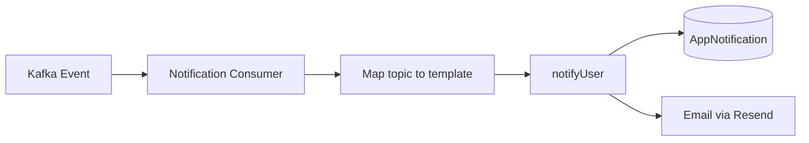

# Notification Service

**Package:** `@finboard/notification-service`  
**Port:** `4007`  
**Location:** `services/notification-service/`

## Overview

The Notification Service manages in-app notifications and optional email delivery for Finboard users. It consumes Kafka domain events from other services to automatically create notifications, and also accepts direct internal HTTP calls for synchronous notification when Kafka is disabled.

## Responsibilities

- Persist in-app notifications per user
- Consume Kafka events and map them to notification templates
- Send optional email notifications via Resend
- Provide unread count and notification inbox APIs
- Mark notifications as read or delete them

## Database

**MongoDB** (`MONGODB_URI`) — collection: `appnotifications`

## API endpoints

### Public — `/api/notifications` (requires JWT)

| Method | Path | Description |
|--------|------|-------------|
| GET | `/unread-count` | Unread notification count |
| GET | `/` | Last 50 notifications |
| PUT | `/:id/read` | Mark notification as read |
| DELETE | `/:id` | Delete notification |

### Internal — `/internal/notifications`

| Method | Path | Description |
|--------|------|-------------|
| POST | `/` | Create notification (+ optional email) |

Internal routes require `x-service-key` header.

### Health

| Method | Path | Description |
|--------|------|-------------|
| GET | `/health` | Service health check |

## Data model

### AppNotification

| Field | Type | Description |
|-------|------|-------------|
| `userId` | ObjectId | Recipient user ID |
| `title` | String | Notification title |
| `message` | String | Notification body |
| `type` | Enum | `general` \| `kyc` \| `banking` \| `investment` |
| `read` | Boolean | Read status |
| `createdAt` | Date | Creation timestamp |

## Business flows

### Kafka-driven notification



1. Kafka consumer receives a domain event
2. Topic is mapped to a notification template (title, message, type)
3. `notifyUser()` persists `AppNotification` in MongoDB
4. If user email is available, async email is sent via Resend

### Event → notification mapping

| Kafka Topic | Title | Type |
|-------------|-------|------|
| `kyc.submitted` | KYC Submitted | kyc |
| `kyc.approved` | KYC Approved | kyc |
| `kyc.rejected` | KYC Rejected | kyc |
| `bank.verified` | Bank Account Verified | banking |
| `order.placed` | Order Placed | investment |
| `order.approved` | Order Approved | investment |
| `order.rejected` | Order Rejected | investment |
| `sip.created` | SIP Created | investment |

### Direct internal notification (Kafka off)

When Kafka is disabled, other services call `notifyUser()` via `@finboard/contracts`, which POSTs to `/internal/notifications`:

1. Service completes a business action (e.g. KYC submit)
2. Calls `notifyUser(userId, title, message, type)` directly
3. Notification persisted + email sent if configured

### User inbox flow

1. User polls `GET /api/notifications/unread-count` for badge
2. User opens inbox via `GET /api/notifications`
3. User marks read via `PUT /:id/read` or deletes via `DELETE /:id`

## Service dependencies

| Service / Package | Direction | Purpose |
|-------------------|-----------|---------|
| Kafka | Inbound | Domain event consumption |
| auth-service | Outbound | User email lookup for email delivery |
| `@finboard/email` (Resend) | Outbound | Email notifications |
| kyc-service, banking-service, investment-service | Inbound | Direct notify calls |

## Events consumed

| Topic | Trigger |
|-------|---------|
| `kyc.submitted` | KYC application submitted |
| `kyc.approved` | KYC approved by admin |
| `kyc.rejected` | KYC rejected by admin |
| `bank.verified` | Bank account verified |
| `order.placed` | Investment order placed |
| `order.approved` | Order approved by admin |
| `order.rejected` | Order rejected by admin |
| `sip.created` | SIP mandate created |

## Events published

None.

## Directory structure

```
services/notification-service/
├── src/
│   ├── server.js
│   ├── app.js
│   ├── bootstrap/register-handlers.js
│   ├── kafka/notification-consumer.js
│   └── modules/notification/
│       ├── routes/notification.routes.js
│       ├── models/notification.model.js
│       ├── services/notification.service.js
│       └── services/email.service.js
├── Dockerfile
└── package.json
```

## Environment variables

| Variable | Description |
|----------|-------------|
| `MONGODB_URI` | MongoDB connection string |
| `KAFKA_BROKERS` | Kafka connection |
| `RESEND_API_KEY` | Email delivery API key |
| `INTERNAL_SERVICE_KEY` | Internal route authentication |

## Run locally

```bash
pnpm --filter @finboard/notification-service dev
```
