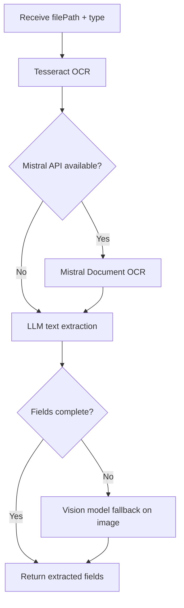

# OCR Service

**Package:** `@finboard/ocr-service`  
**Port:** `4004`  
**Location:** `services/ocr-service/`

## Overview

The OCR Service is an **internal-only** processing service for document OCR and AI-powered KYC verification. It has no public customer-facing routes — all access is via internal HTTP calls from KYC Service (or in-process handlers when co-located).

It extracts structured fields from PAN and Aadhaar document images and runs vision-model verification against submitted identity data.

## Responsibilities

- Run Tesseract OCR on uploaded document images
- Optionally use Mistral Document OCR API for higher accuracy
- Extract structured PAN fields (`name`, `panNumber`) and Aadhaar fields (`name`, `aadhaarNumber`) via LLM
- Perform AI KYC verification with Mistral vision — score fields, recommend approve/review/reject
- Provide rules-based fallback scoring when AI APIs are unavailable

## Database

**None** — stateless processing service. No data is persisted.

## API endpoints

### Internal only — `/internal/ocr`

| Method | Path | Description |
|--------|------|-------------|
| POST | `/process` | OCR a document file |
| POST | `/verify-kyc` | AI KYC verification |

All routes require `x-service-key` header.

> The API Gateway exposes `/api/documents/*` and `/api/ocr/*` proxies, but the service registers no public routes. Customer document processing always goes through KYC Service.

### Health

| Method | Path | Description |
|--------|------|-------------|
| GET | `/health` | Service health check |

## Request / response shapes

### POST `/internal/ocr/process`

**Body:** `{ filePath, type }` where `type` is `pan` or `aadhaar`

**Response:**
```json
{
  "ocrText": "...",
  "extracted": { "name": "...", "panNumber": "..." },
  "extractionSource": "mistral-llm | openrouter-vision | tesseract"
}
```

### POST `/internal/ocr/verify-kyc`

**Body:** Identity data, OCR results, and document file paths

**Response:**
```json
{
  "overallScore": 0.92,
  "recommendation": "approve",
  "fields": [],
  "alignments": [],
  "summary": "...",
  "verificationSource": "mistral-vision"
}
```

Recommendations: `approve` | `review` | `reject`

## Business flows

### Document OCR



1. Receive document file path and type (`pan` / `aadhaar`)
2. Run Tesseract OCR for raw text
3. If Mistral API key present, run Mistral Document OCR
4. LLM extracts structured fields from OCR text (Mistral or OpenRouter)
5. If fields incomplete, vision model reads the image directly
6. Return `{ ocrText, extracted, extractionSource }`

### AI KYC verification

1. Build rules-based fallback score from user input vs identity vs OCR data
2. If `MISTRAL_API_KEY` present, send PAN + Aadhaar images to Mistral vision model
3. Compare extracted fields, compute per-field scores
4. Return overall score and recommendation

## Service dependencies

| Dependency | Purpose |
|------------|---------|
| **Tesseract.js** | Local OCR engine |
| **Mistral API** | Document OCR + vision chat |
| **OpenRouter API** | Fallback text/vision extraction |
| kyc-service | Inbound caller |

## Events

None.

## Directory structure

```
services/ocr-service/
├── src/
│   ├── server.js
│   ├── app.js
│   ├── bootstrap/register-handlers.js
│   └── modules/ocr/
│       ├── routes/ocr.internal.routes.js
│       ├── services/ocr.service.js
│       └── services/kyc-verification.service.js
├── __tests__/kyc-verification.service.test.js
├── Dockerfile
└── package.json
```

## Environment variables

| Variable | Description |
|----------|-------------|
| `MISTRAL_API_KEY` | Mistral OCR and vision API |
| `OPENROUTER_API_KEY` | Fallback LLM/vision provider |
| `INTERNAL_SERVICE_KEY` | Internal route authentication |

## Run locally

```bash
pnpm --filter @finboard/ocr-service dev
```

## Design notes

- Decoupled from KYC Service so OCR/AI providers can be swapped or scaled independently
- Stateless by design — no document retention in this service (files live in KYC storage)
- Graceful degradation: Tesseract + rules-based scoring when cloud APIs are unavailable
