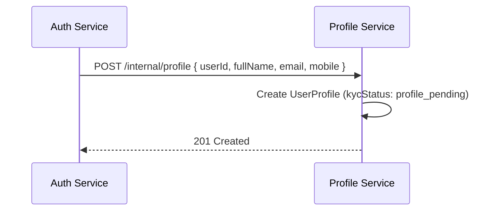
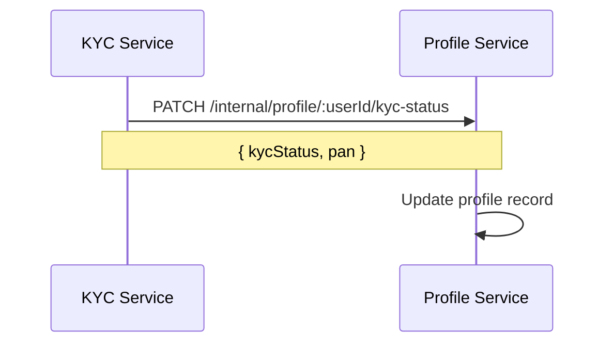

# Profile Service

**Package:** `@finboard/profile-service`  
**Port:** `4002`  
**Location:** `services/profile-service/`

## Overview

The Profile Service stores extended investor profile data beyond what Auth Service keeps for credentials. It is created automatically when a user completes email verification and is updated throughout the KYC and banking journeys.

## Responsibilities

- Create initial profile when auth completes registration
- Serve and update profile data for authenticated users
- Mirror KYC status and PAN from KYC Service
- Provide profile lookups for investment eligibility checks

## Database

**MongoDB** (`MONGODB_URI`) — collection: `userprofiles`

## API endpoints

### Public — `/api/profile`

| Method | Path | Auth | Description |
|--------|------|------|-------------|
| GET | `/me` | JWT | Get or create profile for current user |
| PUT | `/me` | JWT | Update profile fields |

### Internal — `/internal/profile`

| Method | Path | Description |
|--------|------|-------------|
| POST | `/` | Create initial profile |
| GET | `/:userId` | Get profile by user ID |
| PATCH | `/:userId/kyc-status` | Update KYC status and PAN |

Internal routes require `x-service-key` header.

### Health

| Method | Path | Description |
|--------|------|-------------|
| GET | `/health` | Service health check |

## Data model

### UserProfile

| Field | Type | Description |
|-------|------|-------------|
| `userId` | ObjectId | Reference to Auth User (unique) |
| `fullName` | String | Legal full name |
| `dateOfBirth` | Date | Date of birth |
| `pan` | String | PAN number |
| `mobileNumber` | String | Mobile number |
| `emailAddress` | String | Email address |
| `maritalStatus` | String | Marital status |
| `gender` | String | Gender |
| `incomeRange` | String | Income bracket |
| `occupation` | String | Occupation |
| `fatherName` | String | Father's name |
| `motherName` | String | Mother's name |
| `address` | Object | `{ line1, line2, city, state, postalCode, country }` |
| `bank` | Object | `{ holder, maskedAccount, ifsc, bankName, verified }` |
| `kycStatus` | Enum | See below |

**KYC status values:** `not_started` | `profile_pending` | `pending_review` | `approved` | `rejected`

## Business flows

### Profile bootstrap (on registration)



1. Auth Service completes OTP verification
2. Calls `createInitialProfile({ userId, fullName, mobileNumber, emailAddress })`
3. Profile created with `kycStatus: "profile_pending"`

### User profile update

1. User calls `GET /api/profile/me` — upserts from JWT user if missing
2. User calls `PUT /api/profile/me` with demographics, address, etc.
3. Validated fields are persisted

### KYC status sync



Triggered when KYC is submitted, approved, or rejected.

## Service dependencies

| Service | Direction | Purpose |
|---------|-----------|---------|
| auth-service | Inbound | Profile creation after signup |
| kyc-service | Inbound | KYC status updates |
| investment-service | Inbound | Read profile for eligibility |

## Events

None.

## Directory structure

```
services/profile-service/
├── src/
│   ├── server.js
│   ├── app.js
│   ├── bootstrap/register-handlers.js
│   └── modules/profile/
│       ├── controllers/profile.controller.js
│       ├── models/profile.model.js
│       ├── routes/profile.routes.js
│       ├── routes/profile.internal.routes.js
│       └── validators/profile.schema.js
├── Dockerfile
└── package.json
```

## Environment variables

| Variable | Description |
|----------|-------------|
| `MONGODB_URI` | MongoDB connection string |
| `INTERNAL_SERVICE_KEY` | Internal route authentication |

## Run locally

```bash
pnpm --filter @finboard/profile-service dev
```
